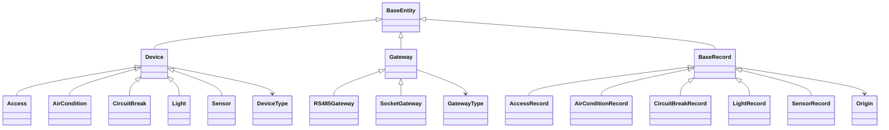

## 测试

正文支持标准 Markdown、代码块、图片、表格和引用。

 [百度](https://www.baidu.com)
  
### checkbox  

- [ ] asdadwa

### table

| 测试  | abc |
| ----- | --- |
| test  | abc |
| acsad | ede |

### code blcok

```mermaid
classDiagram
    BaseEntity <|-- Device
    BaseEntity <|-- Gateway
    BaseEntity <|-- BaseRecord

    Device <|-- Access
    Device <|-- AirCondition
    Device <|-- CircuitBreak
    Device <|-- Light
    Device <|-- Sensor

    Gateway <|-- RS485Gateway
    Gateway <|-- SocketGateway

    BaseRecord <|-- AccessRecord
    BaseRecord <|-- AirConditionRecord
    BaseRecord <|-- CircuitBreakRecord
    BaseRecord <|-- LightRecord
    BaseRecord <|-- SensorRecord

    Device --> DeviceType
    Gateway --> GatewayType
    BaseRecord --> Origin
```
